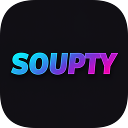

# Soupty

  

<h1 align="center">Soupty</h1>

SOOP(숲) 플랫폼을 위한 강력한 실시간 채팅 및 이벤트 모니터링 데스크톱 애플리케이션

Soupty는 SOOP(숲) 플랫폼의 채팅과 이벤트를 실시간으로 모니터링하고 관리할 수 있는 데스크톱 애플리케이션입니다. 스트리머와 시청자들을 위해 강력한 분석 도구와 로깅 및 검색을 지원합니다.

## 📥 다운로드

**최신 버전을 다운로드하여 지금 바로 사용해보세요!**

## ⚠️ 중요 안내

**📋 사용 전 반드시 읽어주세요**

- **🔍 데이터 수집**: 프로그램 실행 후 SOOP 플랫폼의 공개 데이터를 수집하여 로컬에 저장합니다
- **🚫 비공식 프로그램**: 본 프로그램은 SOOP의 정식 공식 프로그램이 아닙니다
- **🔒 접근 제한**: 일부 채널(19금 채널, 구독 전용 채널)은 접근이 불가능합니다

## ✨ 기능 요약

- **🔴 실시간 모니터링**: WebSocket을 통한 실시간 채팅 및 이벤트 추적
- **💰 스마트 이벤트 분석**: 도네이션, 구독, 팔로우 등 이벤트 자동 분류
- **🤖 AI 기반 감정 분석**: ONNX Runtime을 활용한 채팅 감정 분석 (ai 버전 설치 필요)
- **🔍 전문 검색**: FTS(Full-Text Search)를 통한 채팅 내역 고속 검색
- **💾 로컬 데이터베이스**: SQLite 기반 안전한 로컬 데이터 저장
- **🔐 개인 정보**: 프로그램 사용에 로그인이 필요X
- **💻 저사양**: 간단한 프로그램으로 저사양 컴퓨터에서 잘 동작합니다.

## 🎯 주요 기능

### 📊 시청자 채팅 기록

실시간으로 수신되는 모든 채팅 메시지를 체계적으로 기록하고 관리합니다. 사용자 정보, 채팅 내용, 이모지, 시간 정보 등을 포함한 상세한 채팅 로그를 제공합니다.

  

### 📈 방송 보고서

방송별 상세한 통계와 분석 리포트를 생성합니다. 채팅 참여도, 이벤트 발생 현황, 인기 키워드 등의 인사이트를 시각적으로 확인할 수 있습니다.

  

### 🔍 기록 검색

FTS(Full-Text Search) 기술을 활용한 고속 검색 기능을 제공합니다. 사용자명, 채팅 내용, 날짜 범위 등 다양한 조건으로 채팅 기록을 빠르게 검색할 수 있습니다.

  

### 🖥️ 전체 뷰 (커스터마이징 가능)

모든 기능을 한눈에 볼 수 있는 통합 대시보드입니다. 필요에 따라 UI 구성 요소를 조정하여 개인의 사용 패턴에 맞게 인터페이스를 최적화할 수 있습니다.

  

## 📋 시스템 요구사항

- **운영체제**: Windows 10+
- **메모리**: 최소 1GB RAM 권장
- **저장공간**: 최소 500MB 여유 공간
- **네트워크**: 인터넷 연결 필요

## 🤝 기여하기

이 프로젝트는 개인 프로젝트입니다. 자유롭게 기여해주세요!!
버그 리포트나 기능 제안은 이슈 또는 프로그램 내 구글 폼을 통해 알려주시기 바랍니다.

## 📄 라이선스

MIT

**Soupty**로 SOOP 스트리밍을 더 스마트하게 관리하세요! 🎯
