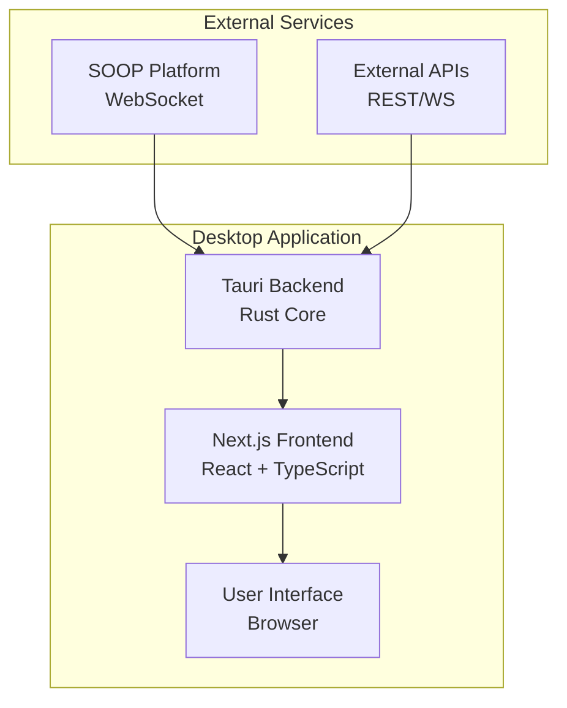
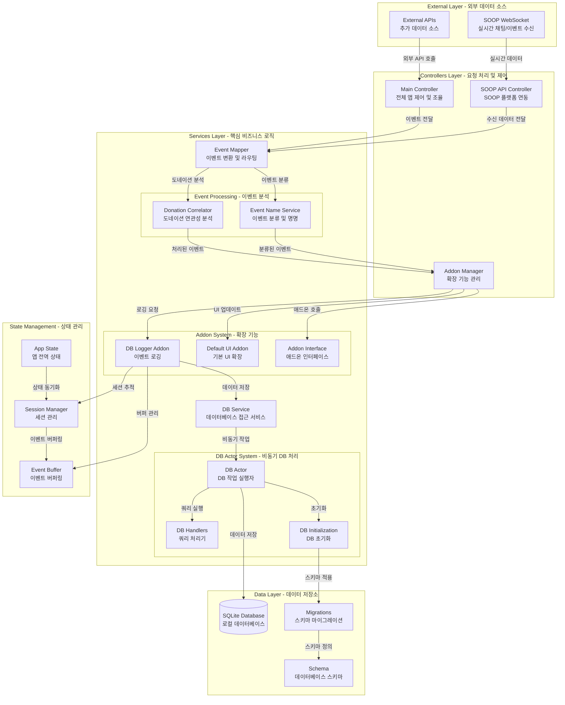
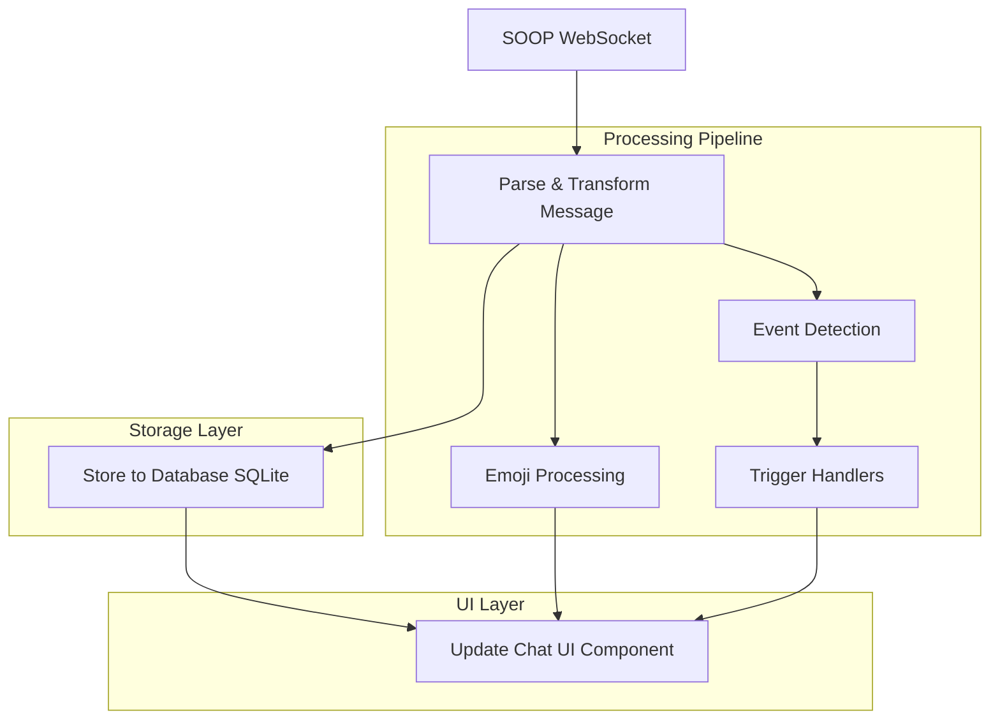
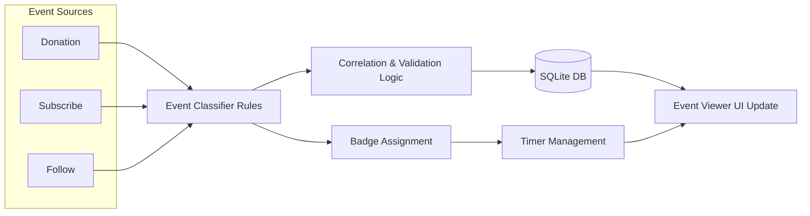
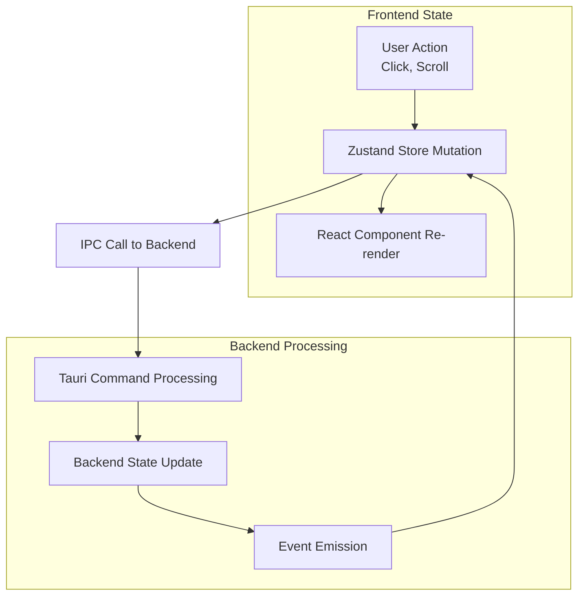

# Soupty

Soupty는 SOOP(숲) 플랫폼의 채팅과 이벤트를 실시간으로 모니터링하고 관리할 수 있는 데스크톱 애플리케이션입니다.

## 주요 기능

- 실시간 채팅 모니터링 및 표시
- 도네이션, 구독 등 이벤트 추적
- 이모지 처리 및 변환
- 감정 분석 (AI 모델 활용)
- 데이터베이스 로깅
- FTS(Full-Text Search)를 이용한 채팅 검색
- 사용자 정의 애드온 시스템

## 기술 스택

### Frontend
- **Next.js 15** - React 프레임워크
- **React 19** - UI 라이브러리
- **TypeScript** - 타입 안전성
- **Tailwind CSS** - 스타일링
- **Zustand** - 상태 관리

### Backend (Tauri)
- **Rust** - 시스템 레벨 성능
- **Tauri** - 크로스 플랫폼 데스크톱 앱
- **SQLite** - 로컬 데이터베이스
- **ONNX Runtime** - AI 모델 추론

## 개발 환경 설정

### 필수 요구사항
- Node.js 18+
- Rust 1.70+
- Yarn 4.9.2+

### 설치 및 실행

1. 저장소 클론
```bash
git clone <repository-url>
cd soupty
```

2. 의존성 설치
```bash
yarn install
```

3. 개발 서버 실행
```bash
yarn dev
```

4. Tauri 앱 실행
```bash
yarn tauri dev
```

5. 프로덕션 빌드
```bash
yarn build
yarn tauri build
```

## 프로젝트 구조

```
soupty/
├── app/                    # Next.js 앱 라우터
├── common/                 # 공통 컴포넌트 및 유틸리티
├── features/               # 기능별 모듈
│   ├── chat/              # 채팅 관련 기능
│   ├── emoji/             # 이모지 처리
│   ├── event/             # 이벤트 관리
│   └── soop/              # SOOP API 연동
├── services/              # 서비스 레이어
├── src-tauri/             # Tauri 백엔드
│   ├── src/               # Rust 소스 코드
│   ├── migrations/        # 데이터베이스 스키마
│   └── ai/                # AI 모델 파일
└── types/                 # TypeScript 타입 정의
```

## 아키텍처

### 전체 시스템 구조



### 백엔드 아키텍처 상세



#### 아키텍처 계층 설명

**External Layer (외부 계층)**
- SOOP 플랫폼으로부터 실시간 WebSocket 연결을 통해 채팅 및 이벤트 데이터를 수신
- 필요시 추가 외부 API들과의 연동 지원

**Controllers Layer (제어 계층)**
- **Main Controller**: 전체 애플리케이션의 생명주기와 주요 기능들을 조율
- **SOOP API Controller**: SOOP 플랫폼 특화 로직 처리
- **Addon Manager**: 확장 기능들의 등록, 실행, 관리

**Services Layer (서비스 계층)**
- **Event Mapper**: 수신된 원시 데이터를 구조화된 이벤트로 변환 및 라우팅
- **Event Processing**: 이벤트의 의미 분석 및 상관관계 파악
- **DB Service**: 데이터베이스 접근을 위한 고수준 인터페이스
- **Addon System**: 플러그인 아키텍처를 통한 기능 확장

**Data Layer (데이터 계층)**
- SQLite를 사용한 로컬 데이터 저장
- FTS5를 활용한 전문 검색 지원
- 스키마 마이그레이션을 통한 데이터베이스 버전 관리

**State Management (상태 관리)**
- 애플리케이션 전역 상태 관리
- 세션 기반 사용자 데이터 추적
- 실시간 이벤트 버퍼링으로 성능 최적화

## 데이터 흐름

### 실시간 채팅 처리 흐름



### 이벤트 처리 흐름



### 상태 관리 흐름



## 라이선스

이 프로젝트는 개인 프로젝트입니다.